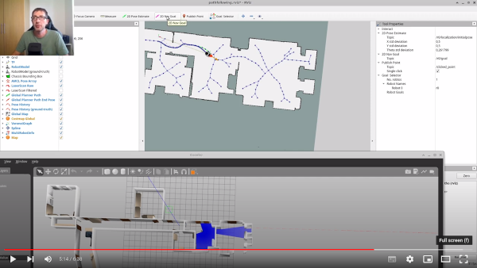

# MPN/MPC
This container is build on ROS1 meldodic has to functionallities.
- Pathfollowing
- MPC
## Pathfollowing

Using the __pathfollowing__ it is possible to follow a path as close as possible. __The vehilce will not stop on obstacles!__
### with gazebo

Start gazebo with the __tuw_diff_drive_plugin__ and the option __diff_iws__ the iws messages are used to send steering and velocity commands to each wheel. It also returns feedback of the actual steering angle and velocity.

```roslaunch tuw_gazebo_models robot_in_world.launch motor_plugin:=diff_iws launch_ground_truth_robot_state_publisher:=false```

To monitor the system and to send goals, one can use the tuw_launches rviz_pathfolling.launch. To visualize splines and voronoi graphs, one has to compile tuw_control_rviz as well as tuw_multi_robot_rviz. tuw_control_rviz holds by default a CATIN_IGNORE file, which needs to be removed manually.

``` roslaunch tuw_launches rviz_pathfollowing.launch ```

The path following needs a laser scan on <robot_name>\laser0\scan. If you run it with our gazebo, you need to launch a laser filter. 

```roslaunch tuw_launches laser_filter.launch robot_name:=r0```

Followed by 

```roslaunch tuw_launches pathfollowing.launch```

[](https://www.youtube.com/watch?v=sZgbYQEULLo)

 


## MPC

